# School District Analysis

## Overview of school district analysis
The aim of this project is to analyze math and reading performance from 15 high schools within the school district. Variables potentially associated with overall school performance include school budget, size of student body, and district vs. charter school type. 
There was also a concern that some scores within the 9th grade class at Thomas High School had been altered. The analyses were repeated after removing this group of students.

## Results 

- The effect on the whole district summary\
    First summary scores for the entire district were generated. 
  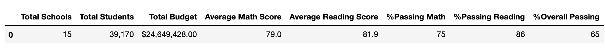
  
  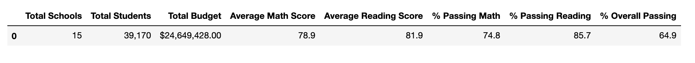

- The effect on Thomas High School results\
    Thomas High School results can be seen in line 2 of the following tables.
  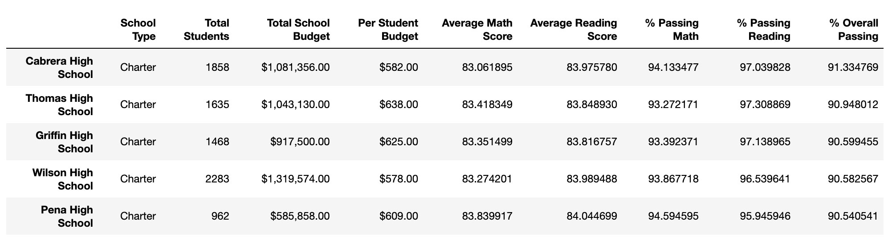
  
  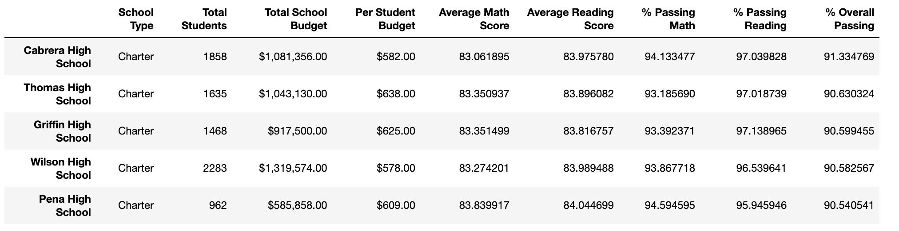

    Thomas High School was the second best school in terms of overall percentage of students passing both tests, regardless of whether 9th graders were included.
    
- Math and Reading scores by grade level.\
    A full table of all schools math and reading skills broken down by grade level shows that Thomas High School 9th graders had an average math score of 83.6 and average reading score of 83.7, both of which are very close to scores from other grades in that school.
    
    Math scores by grade level\
    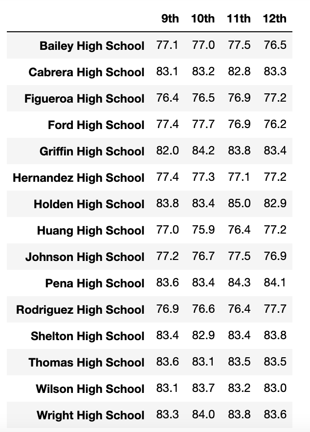
    
    Math scores by grade level, Thomas High 9th grade removed\
    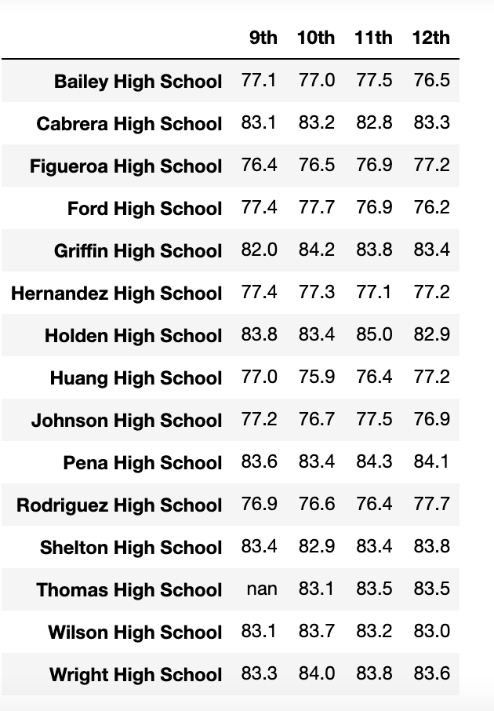
    
    Reading scores by grade level\
    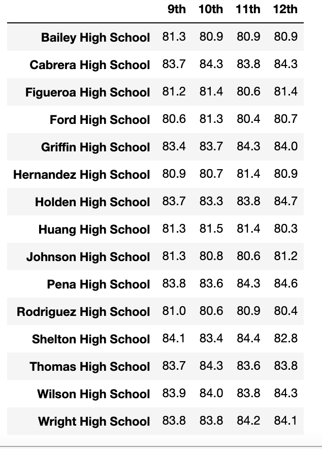
    
    Reading scores by grade level, Thomas High 9th grade removed\
    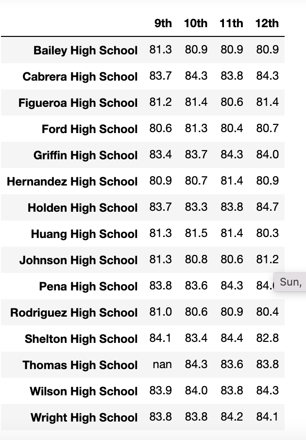

- Relationship of school performance with school budget
    
    School Performance relative to budget\
    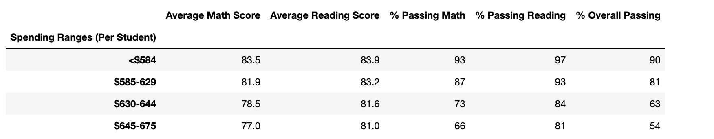
    School Performance relative to budget with Thomas High 9th grade removed\
    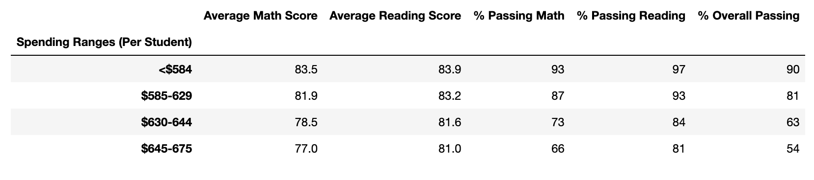
    

- Relationship between school performance and student body size

    School performance relative to school size\
    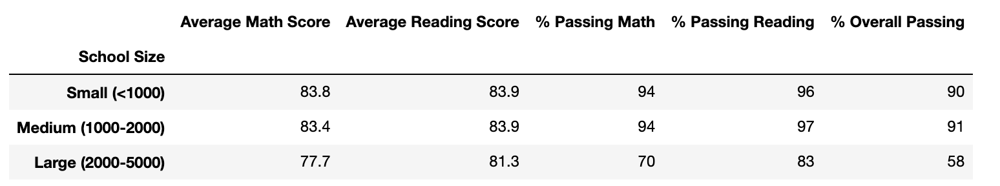
    School performance relative to school size, Thomas High 9th grade removed\
    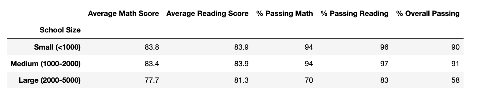

- Relationship between school performance and school type (District vs. Charter)
    
    School performance by school type\
    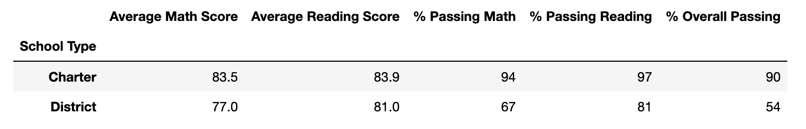
    School performance by school type, Thomas High 9th grade removed\
    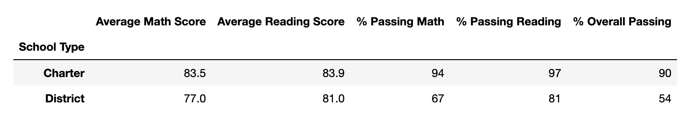
    

## Summary
While there were concerns regarding scores from 9th graders in Thomas High school, their avereage scores of 83.6 and 83.7 for math and reading, respectively, are very close to the scores from other grades. Looking at the other schools, this is to be expected. In general, average scores do not vary between grade levels in any systematic way. Therefore it is not surprising that the absence of these scores does not have a large impact on our analyses.

There are clear relationships between school performance and budget, school size and school type.

The relationship between performance and budget is inverse, with higher spending per student associated with lower overall school performance, particularly in math. Larger school size, and district school type also appear to be associated with lower performance.

However, there are also very strong associations between these potential predictor variables, so additional analyses would be critical before accepting the associations seen here. With the exception of one school, all Charter schools fell in the small or medium sizes, and none of the District schools did. Similarly, spending per student is higher for District schools than for Charter schools. It is possibly and even likely then that factors associated with better performance in Charter schools drives the other associations seen here.
